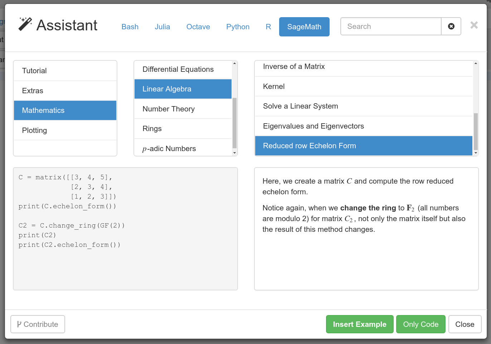

# CoCalc Snippets

A collection of code snippet examples to assist working on CoCalc → [read more](src/README.md).



## Development

The source files are in `/src` and are processed via the `examples.py` Python file.

Usually, just running `make` in the main directory is enough to see if the changes did work.

The output is a unified `examples.json` file, which can be used by other tools -- right now that's [CoCalc](https://cocalc.com).

### Contributions

All examples are collected in `.yaml` files.
The structure of a file is to specify

1.  meta-information of a sequence of example yaml docs. A file starts with them, and there can be additional meta-information documents (which replace the previous one):

* `language`: likely `python`, `sage`, `r`, `gap`, …
* `category` and sub-category, either as an array of strings or a string with `/` delimiter,
* common `setup` code (optionally)
* `variables`: a map to initialize variables
* a `sortweight` to override lexicographic sorting. (e.g. to place "Introduction" categories at the top)

2.  After a category specification, the entries for the examples are made of

* `title`, `description` and `code`,
* Optionally, a field `test`,
  which could either be a doc-test (in case it is a string) or `false`.
  In the latter case, it signals any testing framework to skip this test.

Example:

```
---
language: sage
category: Mathematics / Introduction
sortweight: -1
---
title: Introduction
descr: |
    SageMath is an advanced Python-based environment for mathematics.
    With that foundation, it is also suited for scientific computing,
    statistics, and data analysis.

    Run `version()` to see which version of Sage you're currently working with.
code: |
    version()
---
title: Pitfalls
descr: |
    There is a blurry line between using SageMath and programming.
    Function calls are always `function_name(...)` with round brackets, too.
code: |
    # TODO: fix this expression
    var('x')
    sqrt [ (4 + x) (2 - x) ]
test: false
```

## Development

### Tests

to test the `src/sage` subdirectory:

```
make LANG=sage test
```

To speed things up and skip restarting the kernel (could give false positives, but syntax errors are always triggered)

```
make LANG=sage MODE=fast test
```

### Testing testing

The target `make testtest` runs the `test/` subdirectory.
It's purpose is to confirm that breaking tests show up properly and the examples are read correctly.

## Submodule

When used as a **submodule**, one suitable magic git commands to update all submodules is

```
git submodule foreach "git fetch origin; git checkout master; git reset --hard origin/master"
```

## Acknowledgments

* [Boilerplate](https://github.com/moble/jupyter_boilerplate.git)

## Copyright

SageMath, Inc.

## License

Code: Apache 2.0

Data:
[Creative Commons: Attribution-ShareAlike 4.0 International (CC BY-SA 4.0)](https://creativecommons.org/licenses/by-sa/4.0/) (more detailed information is in the header of the files in `/src`)
